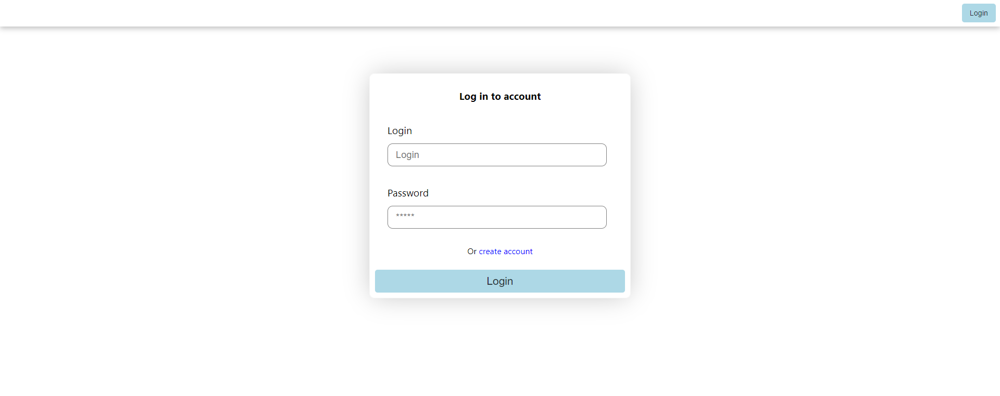
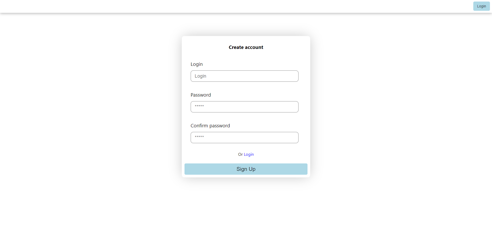
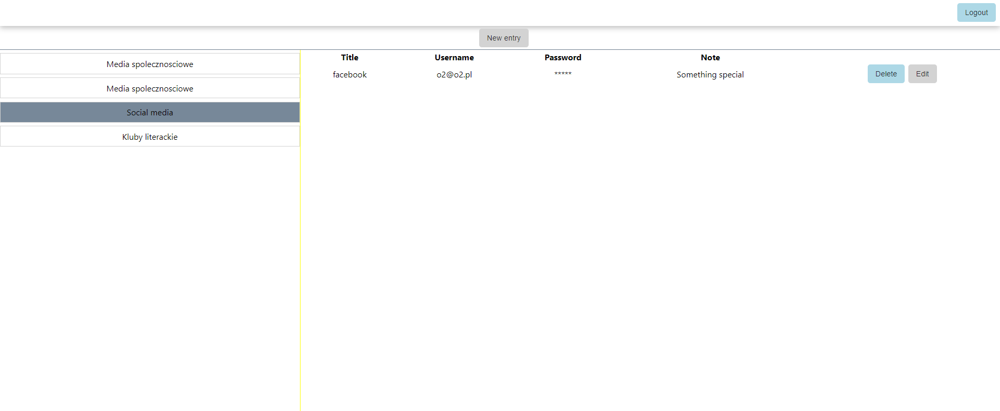
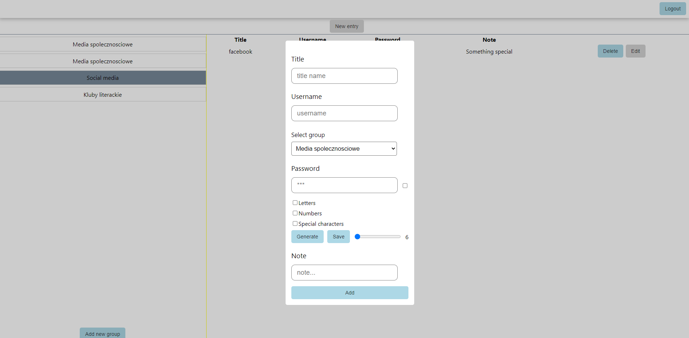
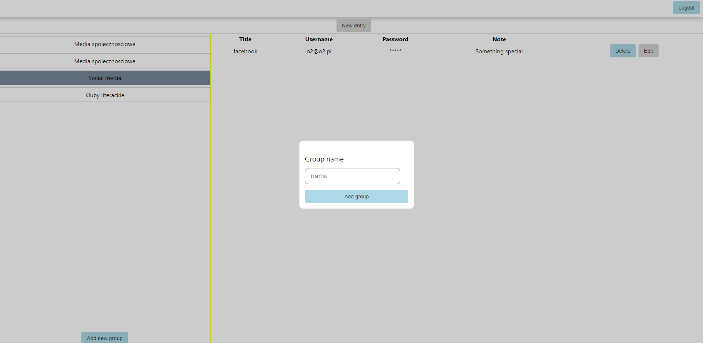

# Application start 
- docker compose up
# Backend
 - Description:
    - Language: TypeScript
    - Server: Node + NestJS
    - Database: MongoDB
    - Auth: jwt
# Frontend
 - Description:
    - Language: TypeScript
    - Libraries : React.js + styled-components + mobx
# Login & Signup

# Password store
## Store

## New entry

## New group of passwords
