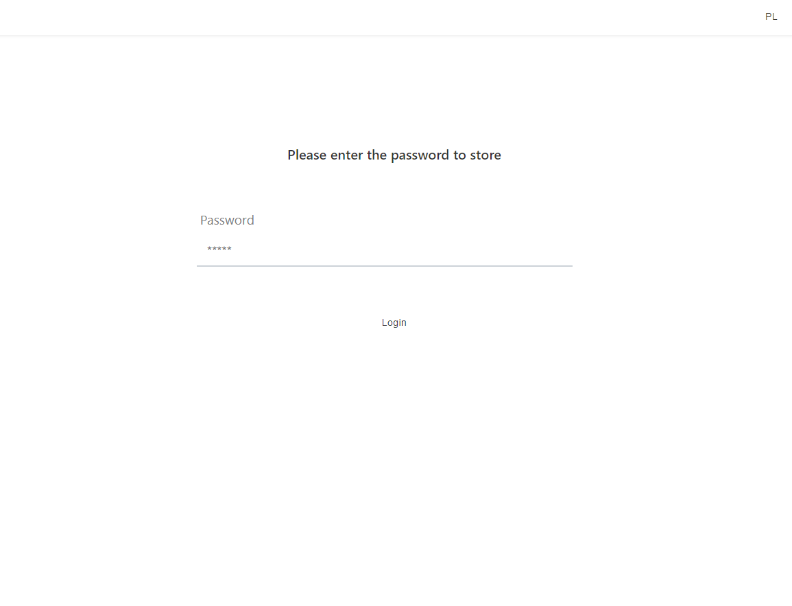

# Application start 
- docker compose up
# Backend
 - Description:
    - Language: TypeScript
    - Server: Node + NestJS
    - Database: MongoDB
    - Auth: jwt
# Frontend
 - Description:
    - Language: TypeScript
    - Libraries : React.js + styled-components + mobx + idb
  - In application we can store passwords in two way. One way is storing in mongodb, second is storing localy in browswer using index db
# Login & Signup

## Online login

## Local login

## Online signup

## Local signup

## Store

## Create new entry

## Delete entry

## Card view

## User view

