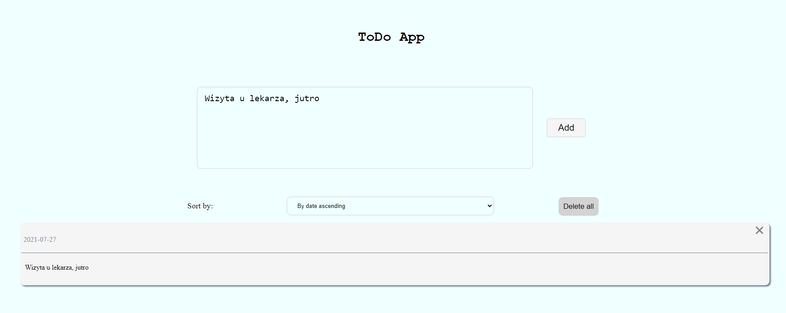
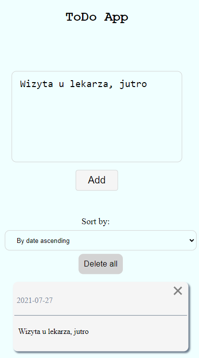

# Application start 
- docker compose up
# Backend
 - Description:
    - Language: TypeScript
    - Server: Node + Express.js
    - Database: MongoDB
# Frontend
 - Description:
    - Language: TypeScript
    - Libraries : React.js + styled-components
# Desktop Image

# Mobile image

